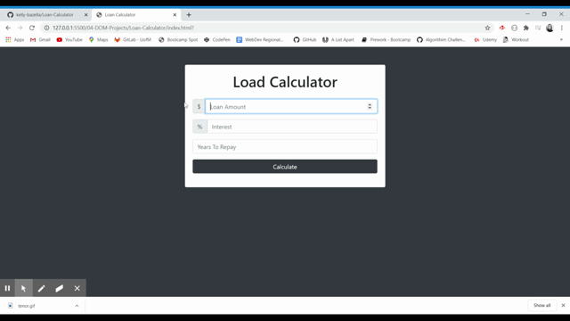

# Loan-Calculator

## How to Use
The user can fork this repositiory and open up the index.html file in their browser to use this application.

## Description
The user is able to enter in the loan amount, interest rate, and how many years they want to take to pay the loan back and the calculator will give information back. 

## Features
- If the user does not enter any information, an error message will appear letting them know they need to enter information. 
- When the user clicks the calculate button, a GIF animation plays for 2 seconds then shows the results

## Languages Used
- HTML
- JavaScript

## GIF
